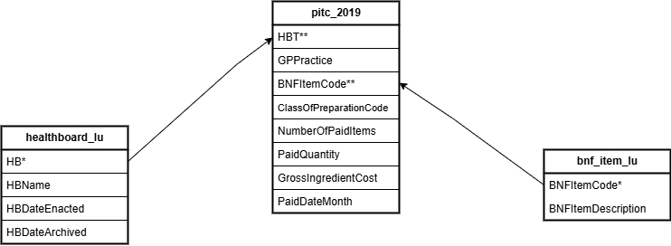

```{r setup, include=FALSE}
knitr::opts_chunk$set(echo = TRUE)
```

```{r include=FALSE}

library(DBI)
library(RMariaDB)

knitr::opts_chunk$set(connection = 'con')

creds <- list(
  host = "92.205.151.0",
  # This is the assessment database we will be using
  dbname = "DB_A01_BOXE",
  # You can use your usual details to access the DB
  user = "USER_14_WQVJ",
  password = "PASS_14_WUGA"
)

con <- dbConnect(MariaDB(),
                 host = creds$host,
                 dbname = creds$dbname,
                 user = creds$user,
                 password = creds$password
                 )

dbListTables(con)
#dbSendQuery('SET SESSION wait_timeout = 1800;')

```

```{r}
knitr::opts_knit$set(connection = con)
```


__Word Count: xxxx__

__Research Question:__
Did health boards prescribe more proprietary or generic branded medicine in 2019?

## Introduction
Studies consistently demonstrate that generic drugs, containing the same active ingredients as their brand-name counterparts, are just as effective and safe, often at a lower cost
## Description of data source
The data that will be used for analysis and writing of  this report was sourced from the NHS website. The dataset is composed of three different tables, namely pitc_2019, healthboard_lu, and bnf_item_lu providing information across different healthboards in the UK for the year 2019. Analysis will specifically be done for prescribing patterns, medication costs, and medicine type preference interms of generic, or proprietary.

### Data Dictionary
The data dictionary will provide full meaning to the variables or columns used in each data table
#### Prescription table - 2019
This table referred to as pitc_2019 in the schema is a prescription table that contains NHS prescription transactions, including medication types, quantity, and cost. Specifically, the table has the following variables/columns:
 - BNFItemCode: A 15 digit code in which the first seven digits are allocated according to the categories in the BNF and the last 8 digits represent the medicinal product, form, strength and the link to the generic equivalent product.
 - ClassOfPreparationCode : This refers to category of the medicine as whether it is generic, or proprietary.
 - NumberOfPaidItems : The number of paid items relates to the number of prescription items dispensed and for which the dispenser has been reimbursed.
 - PaidQuantity : Paid quantity is the total quantity of an individual item for which the dispenser hasbeen reimbursed.
 - GrossIngredientCost : Paid Gross Ingredient Cost is the reimbursement cost for the paid quantity based upon the NHS basic price as listed in the Scottish drug tariff or manufacturer’s price
list.
 - PaidDateMonth : The month and year in which payment is claimed, formatted as yyyymm e.g.
'201801'.

#### health board_lu

This table "health-board_lu" is a table with information about the 14 health-boards in the UK. The table has the following columns:
 - HB : Health Board 2014 Code.
 - HBName : Name of the Health Board.

### Data Types and Keys

-HBT : This a character variable (VARCHAR) that contains unique NHS code for health boards (Foreign Key in pitc_2019 table, and primary key in health board_lu)

- BNFItemCode : This too is a character variable (VARCHAR) that contains unique code for identifying medication (Foreign key in pitc_2019, and primary key in bnf_item_lu).

- ClassOfPreparationCode : Character variable that has a  binary outcome of 'G' for Generic, and 'P' for Proprietary.

- NumberOfPaidItems: An integer variable type, that captures number of prescriptions issued.

- GrossIngredientCost : This is a decimal capturing total cost of prescription

- HBName : A character variable indicating name of healthboard (from bnf_item_lu).

- BNFItemDescription : A character variable showing the description pf medicine sourced from bnf_item_lu table.

## Rationale for column selection
In the analysis the following variables were selected :
- ClassOfPreparationCode was selected as it allows us to compare the generic, and proprietary prescribing patterns.

- GrossIngredientCost Enables us to help assess the budget impact.


## Exploratory Data Analysis
Exploratory data analysis was conducted in order to understand the datasets. SQL codes DESC followed by table name were used to understand the structure of each table. One key insight from this was identification of the primary keys in each table, which was important in construction of the ERD.

```{sql, connection = con}
DESC  pitc_2019
```


```{sql connection="con"}
#| echo: true
DESC  healthboard_lu
```

```{sql connection="con"}

DESC  bnf_item_lu
```

```{sql connection="con"}

SELECT DISTINCT(ClassOfPreparationCode)
FROM
  pitc_2019
```

```{sql connection = "con"}
SELECT*
FROM 
  healthboard_lu
LIMIT 5
```

```{sql connection = "con"}
SELEct*
FROM 
  pitc_2019
LIMIT 5
```

```{sql connection = "con"}
DESC pitc_2019
```

```{sql connection = "con"}
SELEct*
FROM 
  bnf_item_lu
LIMIT 5
```

## Data Analysis
We created a virtual table named V_USER_14 which is a product of 2 joined tables from prescription tables (pitc_2019), and healthboard look up  tables (health board lu). Below is the ERD illustrating the relationmship between these tables, note that in the ERD we went further and added the relationship to the third table which we had plans to use, but did not consequently use.

### ERD
```{r echo=FALSE, fig.cap="ERD diagram", out.width = '100%'}

```


```{sql connection="con"}
SELECT
  p.HBT AS Unique_NHS_Code,
  p.BNFItemCode AS item_Code,
  p.ClassOfPreparationCode AS class_preparation,
  p.NumberOfPaidItems,
  p.PaidQuantity,
  p.GrossIngredientCost,
  h.HBName,
  b.BNFItemDescription,
  CASE 
    WHEN ClassOfPreparationCode = 'G' then 'generic'
    WHEN ClassOfPreparationCode = 'p' then 'proprietary'
    ELSE 'Other'
  END AS class_preparation_cleaned
FROM
  pitc_2019 AS p
LEFT JOIN
  healthboard_lu AS h
ON
  p.HBT = h.HB
LEFT JOIN 
  bnf_item_lu AS b
ON
  p.BNFItemCode = b.BNFItemCode
LIMIT 10
```


The code below creates a virtual table that will be used to extract 


CREATE VIEW V_USER_14 AS 
(SELECT
  p.ClassOfPreparationCode AS medicine_type, 
  COUNT(*) AS count_prescription, -- total number of prescription
  SUM(p.NumberOfPaidItems) AS total_items, 
  SUM(p.GrossIngredientCost) AS total_cost, 
  h.HBName AS Health_Board,
  CASE 
    WHEN p.ClassOfPreparationCode = 'G' THEN 'generic'
    WHEN p.ClassOfPreparationCode = 'P' THEN 'proprietary'
    ELSE 'Other'
  END AS class_preparation_cleaned
FROM
  pitc_2019 AS p
LEFT JOIN
  healthboard_lu AS h
ON
  p.HBT = h.HB
WHERE
  p.ClassOfPreparationCode IN ('G', 'P')
GROUP BY
  h.HBName, p.ClassOfPreparationCode
ORDER BY 
  h.HBName ASC, total_cost DESC)


```{sql connection = "con"}
SELECT
  p.ClassOfPreparationCode AS medicine_type,
  COUNT(*) AS count_prescription, 
  SUM(p.NumberOfPaidItems) AS total_items,
  SUM(p.GrossIngredientCost) AS total_cost,
  h.HBName AS Health_Board,
  CASE 
    WHEN ClassOfPreparationCode = 'G' then 'generic'
    WHEN ClassOfPreparationCode = 'P' then 'proprietary'
    ELSE 'Other'
  END AS class_preparation_cleaned
FROM
  pitc_2019 AS p
LEFT JOIN
  healthboard_lu AS h
ON
  p.HBT = h.HB
WHERE
  p.ClassOfPreparationCode IN('G', 'P')
GROUP BY
  h.HBName, p.ClassOfPreparationCode
ORDER BY 
  Health_Board, total_cost DESC
```


```{sql connection = "con"}
SELECT
  p.ClassOfPreparationCode AS medicine_type,
  COUNT(*) AS count_prescription, -- Total number of prescriptions
  SUM(p.NumberOfPaidItems) AS total_items, -- Total items prescribed
  SUM(p.GrossIngredientCost) AS total_cost, -- Total cost of prescriptions
  h.HBName AS Health_Board,
  CASE 
    WHEN p.ClassOfPreparationCode = 'G' THEN 'generic'
    WHEN p.ClassOfPreparationCode = 'P' THEN 'proprietary'
    ELSE 'Other'
  END AS class_preparation_cleaned
FROM
  pitc_2019 AS p
LEFT JOIN
  healthboard_lu AS h
ON
  p.HBT = h.HB
WHERE
  p.ClassOfPreparationCode IN ('G', 'P')
GROUP BY
  h.HBName, p.ClassOfPreparationCode
ORDER BY 
  h.HBName ASC, total_cost DESC;
```


```{sql connection="con"}
SELECT*
FROM
  V_USER_14
WHERE
  total_cost >5.8
```

Exploring the distribution of medicine type by health boards will help us understand which health boards use more of either generic, and proprietary medication class. The code below extracts a dataset that will be used to create a visual showing total cost by health board with respect to medicine type. 

```{sql connection = "con"}

WITH merged_data AS (
SELECT
Health_Board,
class_preparation_cleaned,
total_cost,
(SELECT AVG(total_cost) from V_USER_14) AS NHS_average_cost
FROM
  V_USER_14
WHERE
  total_cost > 5.8
ORDER BY
  total_cost DESC)
SELECT
  Health_Board,
  class_preparation_cleaned AS Medicine_category,
  total_cost,
  NHS_average_cost
FROM 
  merged_data
GROUP BY
  Health_Board,
  Medicine_category,
  Health_Board
ORDER BY
  total_cost ASC;
```


Obtaining average, minimum, maximum metrics from the V_USER_14 virtual table using a common table expression
```{sql connection = "con"}
WITH merged_data AS (
SELECT
Health_Board,
class_preparation_cleaned,
total_cost,
(SELECT AVG(total_cost) FROM V_USER_14) AS NHS_average_cost
FROM
  V_USER_14
WHERE
  total_cost >5.8 )
SELECT
  class_preparation_cleaned,
  MAX(total_cost) AS Max_total_cost,
  MIN(total_cost) AS Min_total_cost,
  AVG(total_cost) AS Mean_total_cost,
  STDDEV_SAMP(total_cost) AS Standard_Dev
FROM 
  merged_data
WHERE 
  total_cost > 5.8 
GROUP BY
  class_preparation_cleaned
```


From the results above, the highest spending for generic drugs is greater than for proprietary prescriptions, showing that some health boards are prescribing more generic medicine compared to proprietary. However, the average total cost is almost the same for both generic, and proprietary prescriptions. The high standard deviations could suggest that there is significant variability in terms of total costs across health boards which could be influenced by several factors such as population, preference, and  prescribing patterns among others.

Getting mean cost per healthboard

```{sql connection  = "con"}
SELECT
  Health_Board,
  total_cost
FROM
  V_USER_14
GROUP BY
  Health_Board
ORDER BY 
  total_cost DESC;
```


Getting proportion of medicine type interms of cost
```{sql connection  = "con"}
SELECT
  class_preparation_cleaned,
  SUM(total_cost) AS total_spent,
  ROUND((SUM(total_cost)*100)/(SELECT SUM(total_cost) FROM V_USER_14),1) AS percentage_spent
FROM
  V_USER_14
GROUP BY
  class_preparation_cleaned
ORDER BY 
  total_spent DESC;
```

The NHS in 2019 spent slightly more on proprietary prescriptions (50.7%) than on generic medicines. This could mean that while generic prescriptions are commonly used, some health boards still largely rely on proprietary medicines due to supposedly patent restrictions, prescriber preferences among other reasons. 


```{sql}
#| label: set-timeout
#| include: false
SET SESSION wait_timeout = 1800;
```
