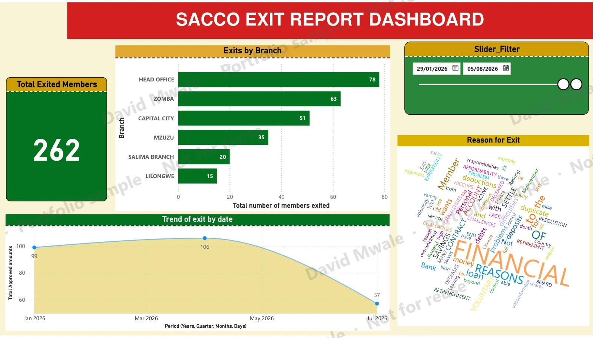
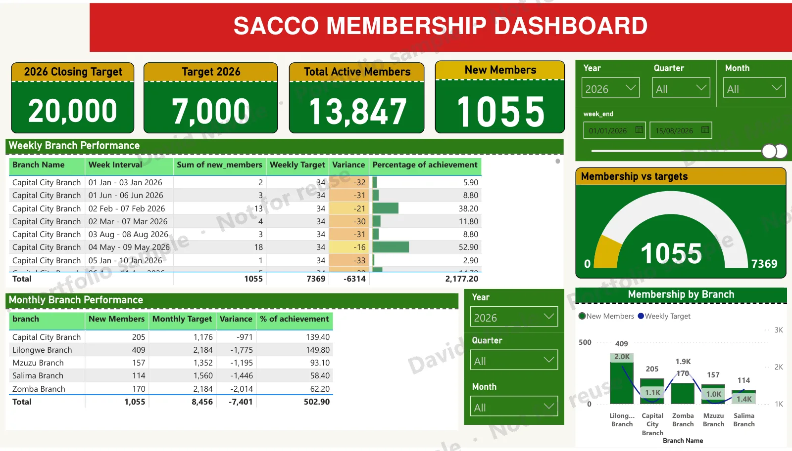
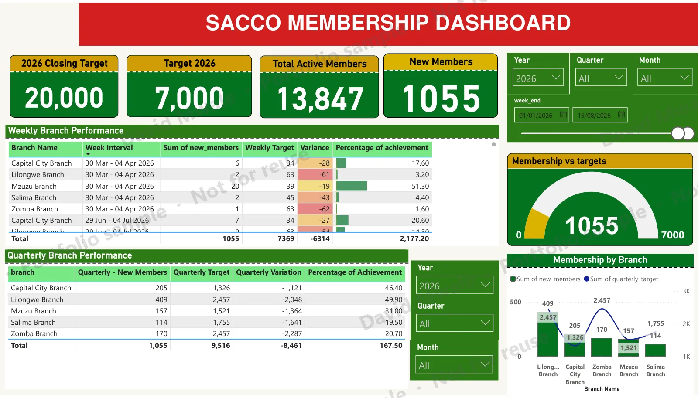
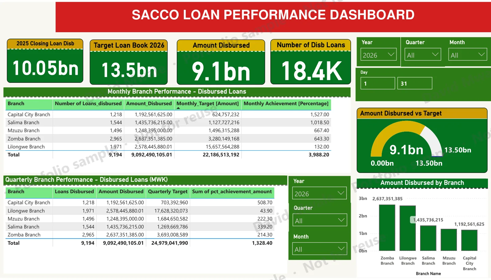
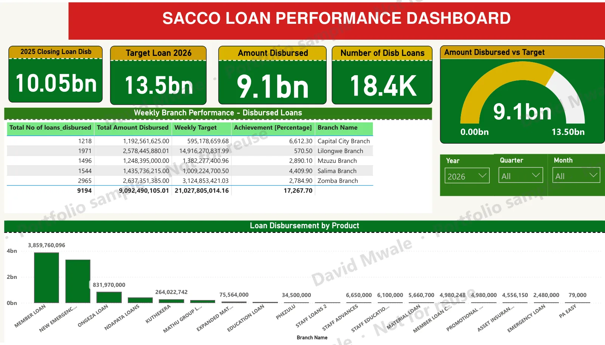
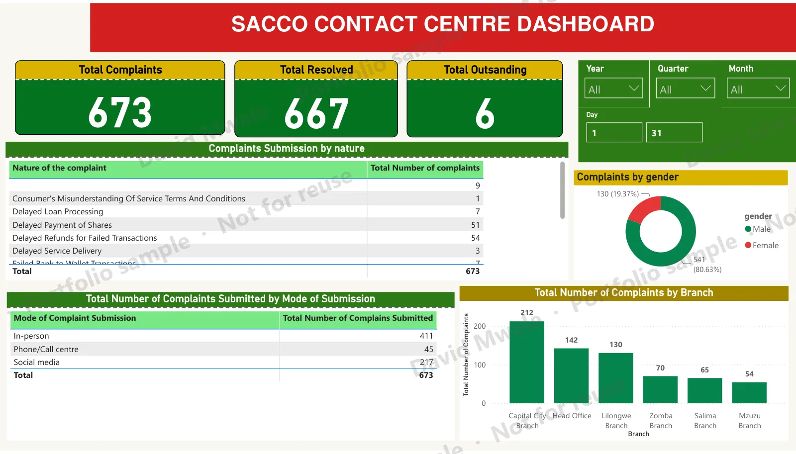
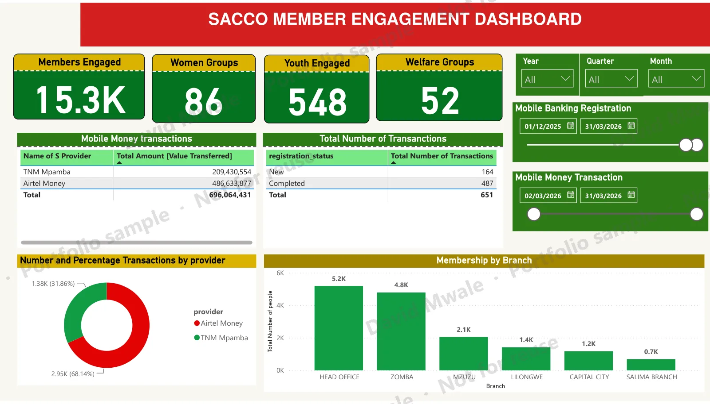
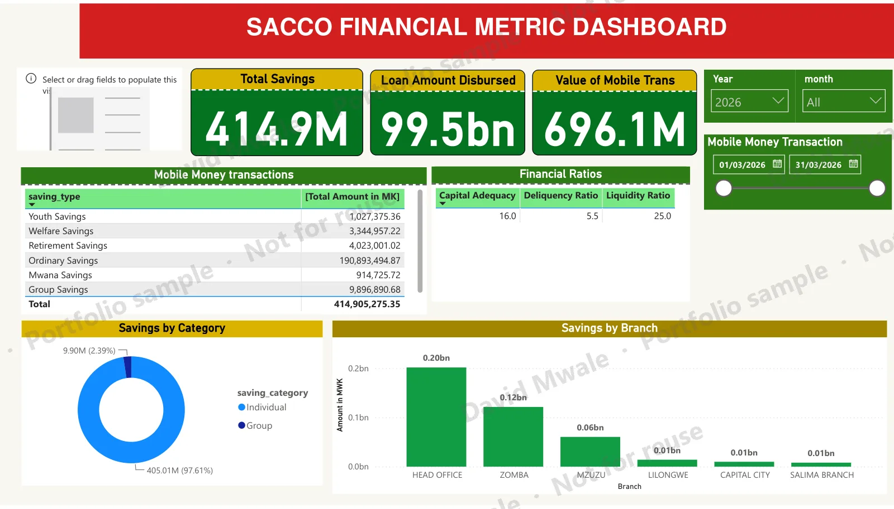
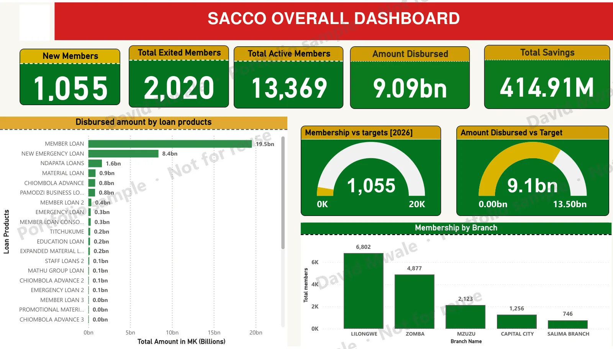

::: {.callout-note appearance="simple"}
**Client work sample, view only.** The organisation's name and logo have been removed.
:::

## The brief

A savings and credit co-operative (SACCO) with six branches needed one place for management to track member growth, loan disbursement, member exits, complaints and savings against annual targets. Before this, the figures came from separate exports and branch spreadsheets.

## What I built

A nine-page Power BI report, each page answering one management question:

| Page | Question it answers |
|---|---|
| Exit report | How many members are leaving, from which branches, and why? |
| Membership (weekly & quarterly) | Are branches recruiting enough new members to hit targets? |
| Loan performance | How much has been disbursed against the loan-book target, by branch and product? |
| Contact centre | What are members complaining about, through which channel, and how many are resolved? |
| Member engagement | How many members, women's groups and youth are active, and how are they using mobile money? |
| Financial metrics | What do savings look like by type, and what are the capital adequacy, delinquency and liquidity ratios? |
| Overall | The headline view for the board. |

**Techniques:** DAX measures for targets, variance and percentage achievement; gauges for actual vs target; conditional formatting on variance; date-range, year, quarter and month slicers; a word cloud of free-text exit reasons; and a consistent layout so non-technical users can read every page the same way.

## Gallery

Click any page to enlarge it.

::: {.dash-gallery}
{group="dash"}

{group="dash"}

{group="dash"}

{group="dash"}

{group="dash"}

{group="dash"}

{group="dash"}

{group="dash"}

{group="dash"}
:::

```{=html}
<script>
document.addEventListener("contextmenu", function (e) {
  if (e.target.closest(".dash-gallery, .gslide-media")) e.preventDefault();
});
document.addEventListener("dragstart", function (e) {
  if (e.target.closest(".dash-gallery, .gslide-media")) e.preventDefault();
});
</script>
```

Would you like to discuss a dashboard like this for your organisation? [Get in touch](mailto:mwaledaveed@gmail.com?subject=Power%20BI%20dashboard%20enquiry).
